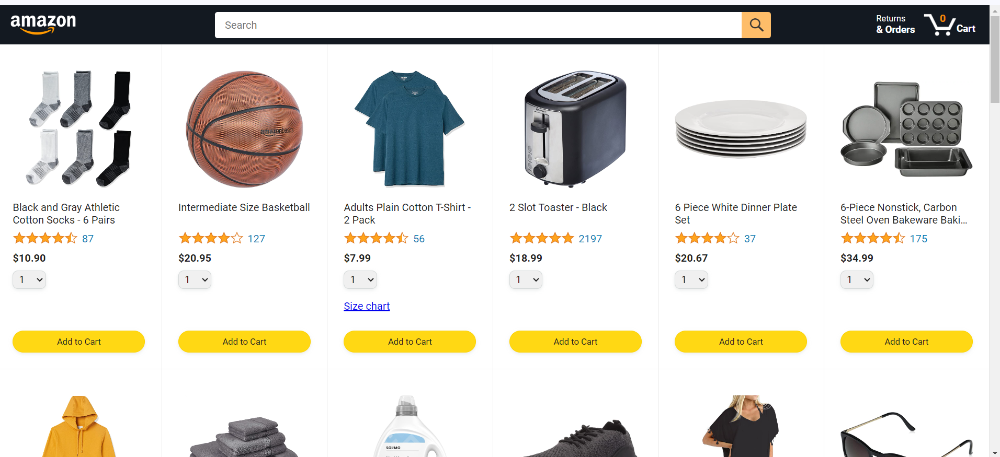
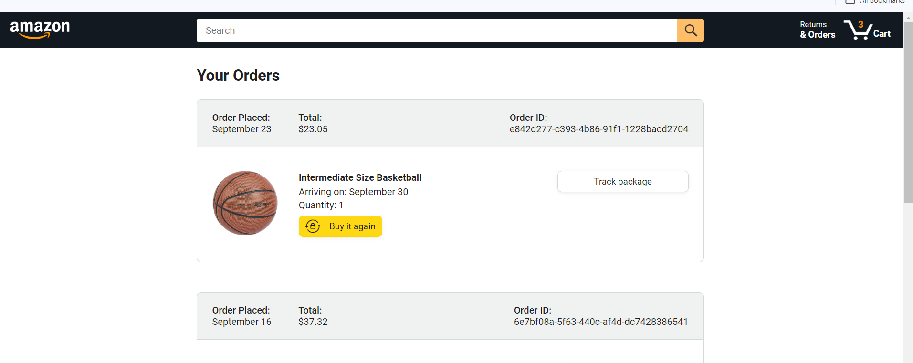
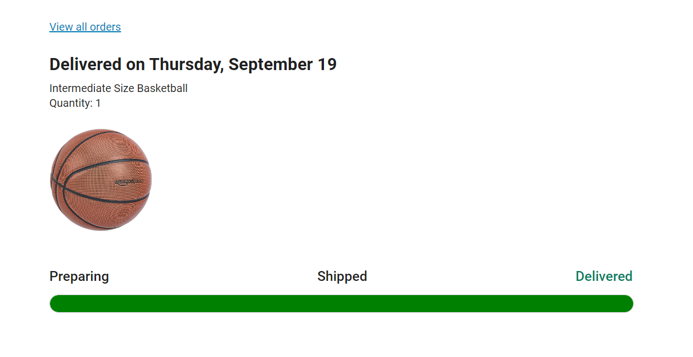

# Amazon_Website_Clone
## 🛒 Amazon Clone - Fully Functional E-Commerce Web Application
Welcome to the Amazon Clone, a fully functional e-commerce web application built with JavaScript! This project was created as a learning exercise following a tutorial by SuperSimpleDev on YouTube. The app allows users to search for products, place orders, checkout, and track their orders, simulating a real-world e-commerce experience.

Most of the HTML is dynamically generated using JavaScript, making this an excellent showcase of my JavaScript learning journey and front-end development skills.

## 🚀 Features
Product Search: Search for items by category or keyword.
Add to Cart & Checkout: Fully functional shopping cart where users can add items, proceed to checkout, and place orders.
Order Tracking: Users can track their order status in real-time.
Dynamic Rendering: Most of the HTML is dynamically generated using JavaScript, providing a smooth and interactive user experience.
Responsive Design: Optimized for various screen sizes, ensuring usability on both mobile and desktop.

## 📸 Screenshots
### Home Page

### Cart and Checkout

### Orders

### Tracking

## 💻 Tech Stack
JavaScript: The backbone of this project, used for DOM manipulation and dynamic content rendering.
HTML5 & CSS3: For the basic structure and styling of the application.
LocalStorage API: To persist user cart data across sessions.
Backend: The backend functionality (e.g., placing orders, tracking) was powered by the tutorial's backend.

## 📚 What I Learned
1.JavaScript DOM Manipulation: Mastered how to dynamically generate and update HTML elements using JavaScript.
2.Handling User Inputs: Built interactive forms for adding items to the cart and placing orders.
3.State Management: Used the browser's LocalStorage API to manage the state of the shopping cart and order history.
4.Responsive Web Design: Improved my knowledge of media queries to make the app accessible on different screen sizes.

## 🤝 Contributing
Contributions are welcome! If you find any bugs or have suggestions for improvements, feel free to submit an issue or pull request.

## 📬 Contact
If you have any questions or want to connect, feel free to reach out:

LinkedIn: https://www.linkedin.com/in/shanmuga-pradeepan-r/
GitHub: https://github.com/Pradeepan544

## 🙏 Acknowledgments
A big thanks to SuperSimpleDev for the comprehensive JavaScript tutorial that guided the creation of this project!
